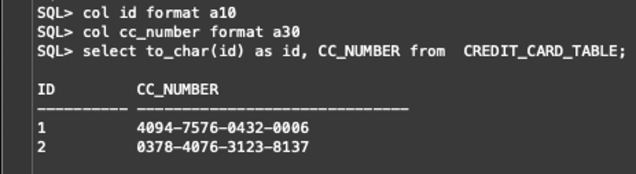
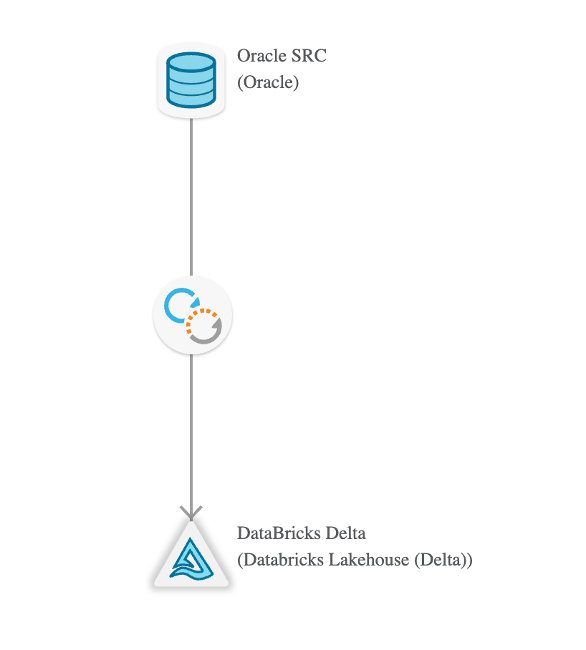
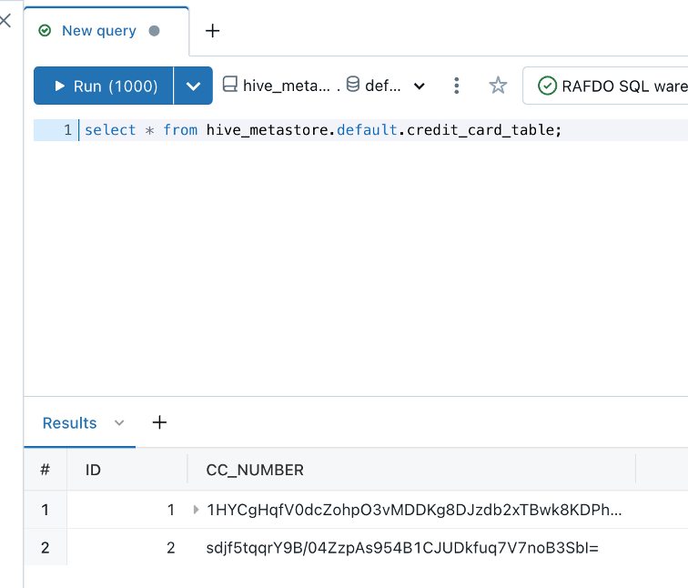
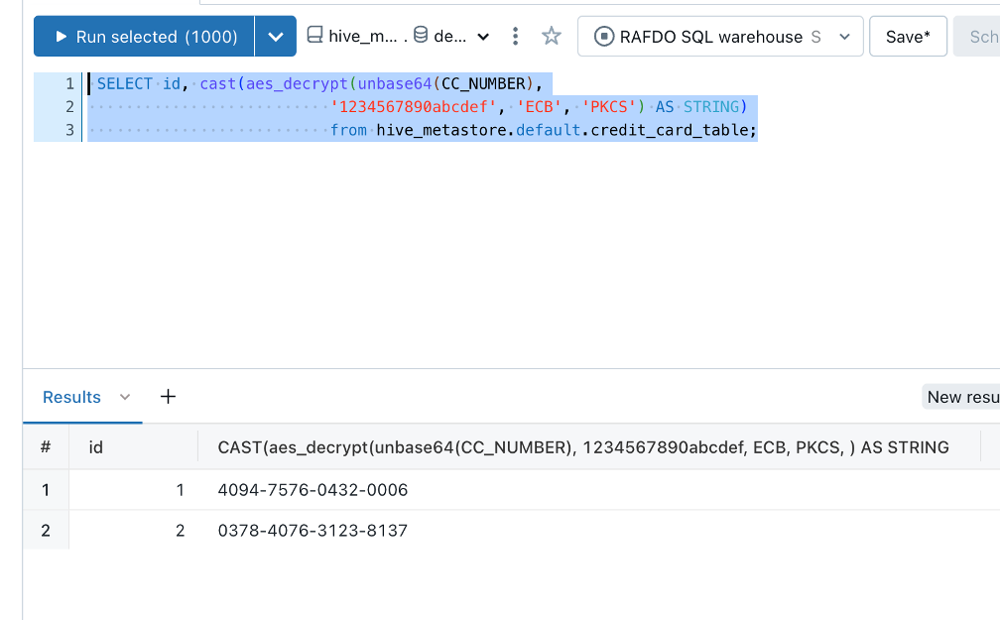

## ReplicateAES 

# Summary
The following repo provides a procedure to encrypt column's data in Qlik Replcate. Let's say we have an Oracle table with credit card information:

We have the following Replicate task:

And we want the information to be encrypted before arriving to DataBricks

But still be able to decrypt the table with the proper key:

