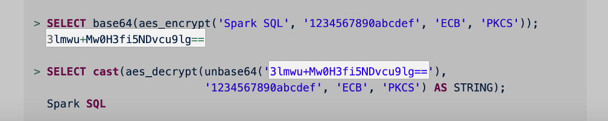

# ReplicateAES 

## Summary
The following repo provides a procedure to encrypt column's data in Qlik Replcate. Let's say we have an Oracle table with credit card information:


We have the following Replicate task:


And we want the information to be encrypted before arriving to DataBricks


But still be able to decrypt the table with the proper key:


## Quick Start - Replicate Linux
Ensure you have openssl installed on your Linux OS:

```console
$ sudo yum install -y openssl-devel
```

After installing Qlik Replicate in Linux, move to the <INSTALL_DIR>/addons/samples directory and check the contents:

```console
$ cd /opt/attunity/replicate/addons/samples/
$ ls -lrth
total 0
drwxrwxr-x. 2 qlik qlik 148 Feb 20 14:00 MyPasswordProvider
drwxrwxr-x. 2 qlik qlik 148 Feb 20 14:00 MyTransformation
drwxrwxr-x. 2 qlik qlik 131 Feb 20 14:00 docker
```

MyTransformation is the User-defined Transformation template that we include in our product. Let’s copy the entire directory to implement aes_encrypt():

```console
$ cd /opt/attunity/replicate/addons/samples
$ cp -Rp MyTransformation aes_encrypt
```

Copy the types defined in ar_addon.h and ar_addon_transformation.h to the following path:

```console
$ cd /opt/attunity/replicate/addons/include
$ cp *.h /opt/attunity/replicate/addons/samples/aes_encrypt/.
```

Let’s rename MyTransformation.c and clean up the rest of MyTransformation files:

```console
$ cd /opt/attunity/replicate/addons/samples/aes_encrypt
$ mv MyTransformation.c aes_encrypt.c 
$ rm MyTransformation*
$ ll
total 20
-rwxrwxr-x. 1 qlik qlik 7014 Feb 26 11:42 ar_addon.h
-rwxrwxr-x. 1 qlik qlik 2650 Feb 26 11:43 ar_addon_transformation.h
-rwxrwxr-x. 1 qlik qlik 2446 Jan 14 00:29 aes_encrypt.c
-rwxrwxr-x. 1 qlik qlik  543 Jan 14 00:29 Makefile
```

Upload the contents of aes_encrypt.c from this repository or replace the file (ensure you maintain the same permissions).

We include a Makefile that simplifies the compilation but we need replace the MyTrasformation string with the new UDT name:

```console
$ cd /opt/attunity/replicate/addons/samples/aes_encrypt
$ grep -i MyTransformation Makefile
TARGET_LIB = MyTransformation.so # target lib
SRCS = MyTransformation.c # source files
        cp ./MyTransformation.so ../../
$ sed -i 's/MyTransformation/aes_encrypt/g' Makefile
$ grep -i MyTransformation Makefile
$
```

Let’s compile the new UDF:
```console
$ cd /opt/attunity/replicate/addons/samples/aes_encrypt
$ make
cc -fPIC -Wall -Wextra -O2 -g -I../../include  -MM aes_encrypt.c >aes_encrypt.d
cc -fPIC -Wall -Wextra -O2 -g -I../../include    -c -o aes_encrypt.o aes_encrypt.c
aes_encrypt.c: In function ‘encrypt_aes_ecb_pkcs7’:
aes_encrypt.c:67:15: warning: unused variable ‘key_length’ [-Wunused-variable]
     const int key_length = strlen(private_key);
               ^~~~~~~~~~
cc -shared   -o aes_encrypt.so aes_encrypt.o
$
```

In the <INSTALL_DIR>/addons directory, copy the addons_def.json.sample and edit the json to reflect the new library:

```console
$ cd /opt/attunity/replicate/addons
$ cp -p addons_def.json.sample addons_def.json 
$ vim addons_def.json
{
        "addons":
        [
                {
                        "name": "MyPasswordProvider",
                        "type": "STARTUP",
                        "lib_path": "samples/MyPasswordProvider/MyPasswordProvider.so",
                        "init_function":        "ar_addon_init"
                },
                {
                        "name": "MyTransformation",
                        "type": "STARTUP",
                        "lib_path": "samples/MyTransformation/MyTransformation.so",
                        "init_function": "ar_addon_init"
                },
                {
                        "name": "aes_encrypt",
                        "type": "STARTUP",
                        "lib_path": "samples/aes_encrypt/aes_encrypt.so",
                        "init_function": "ar_addon_init"
                }
        ]
}
```

Save the addons_def.json and restart the replicate service: 

```console
$ /opt/attunity/replicate/bin/areplicate stop
$ sudo lsof -i:3552
$
$ /opt/attunity/replicate/bin/areplicate start
```
After restarting the service, access the Qlik Replicate GUI and check the UDT is visible now:


Let’s test the function with input data provided with us, to see if we achieve the same result as in DataBricks before starting the Replicate Task:


We can see the encrypted string matches with the one provided in the DataBricks documentation:



More info about DataBricks aes_encrypt() in:

https://docs.databricks.com/en/sql/language-manual/functions/aes_encrypt.html

Note: If you're using Oracle, ensure the table columns where you'll be using the UDF, have supplemental logging, e.g.:

SQL> ALTER DATABASE ADD SUPPLEMENTAL LOG DATA (ALL) COLUMNS;
